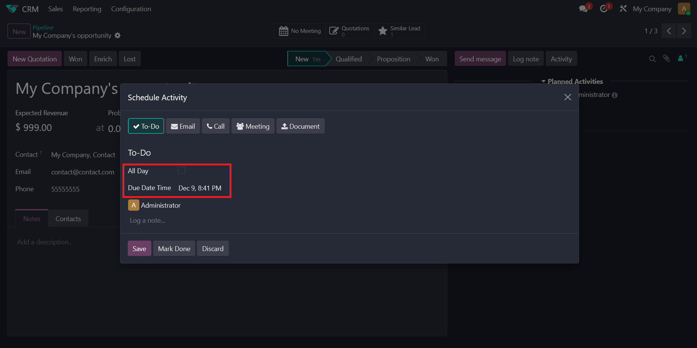
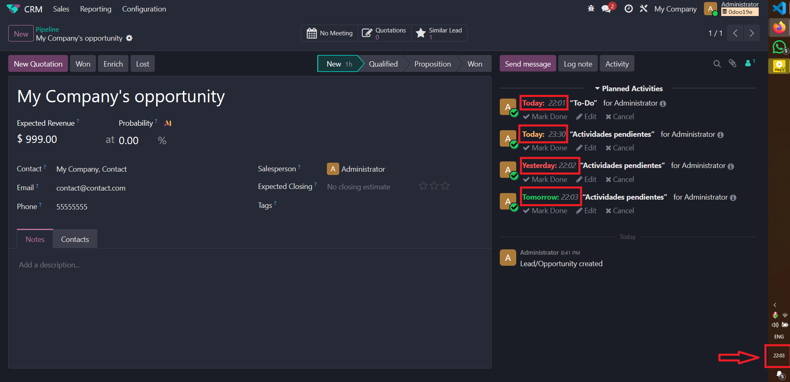
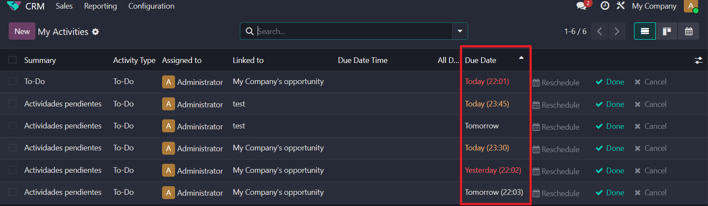
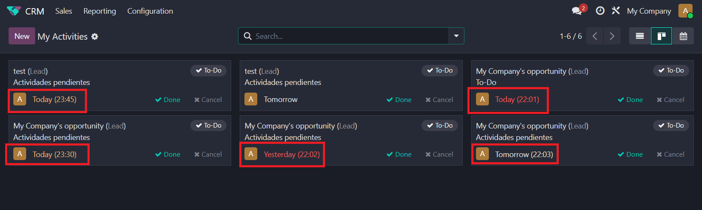

# E Activity DateTime

## Overview

This Odoo module enhances the standard `mail.activity` functionality by adding the ability to specify a precise time for an activity's due date, not just a date. It introduces a "Due Date Time" field and an "All Day" toggle, giving users more granular control over activity scheduling and tracking.

## Key Features

- **Precise Due Times:** Adds a `datetime` field to activities, allowing users to set a specific time for the deadline.
- **"All Day" Option:** An "All Day" checkbox is provided to easily switch between the standard date-only deadline and the new datetime deadline. When "All Day" is checked, the module functions like the standard Odoo activity feature.
- **Activity Form:** Conditionally shows the date or datetime picker based on the "All Day" setting.
- **Chatter Widget:** For activities due "Today", the specific due time is displayed (e.g., `Today: (15:30)`). The activity status (e.g., changing color from warning to danger) also updates in real-time when the due time passes, not just at midnight.

- **List and Kanban Views:** The "Due Date" column is enhanced to show the time alongside the date for non-all-day activities that are due soon.

###### List View

###### Kanban View

- **Integrated Scheduling:** The "Schedule Activity" wizard is updated to incorporate the "All Day" and "Due Date Time" fields, ensuring a consistent experience when planning activities.
- **Automatic status change in Chatter:** The color in Chatter automatically changes if it corresponds to the time of the activity.
